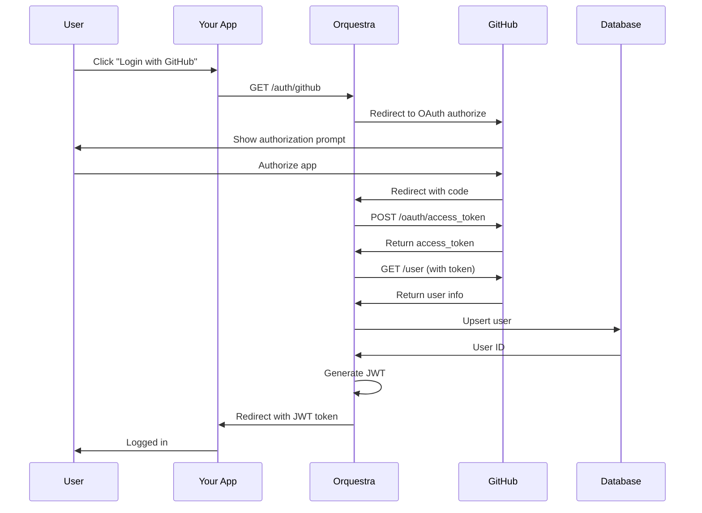

## Overview

Orquestra uses GitHub OAuth for user authentication. The flow creates or updates a user account in the database and returns a JWT token for subsequent API requests.

## OAuth Flow

<Steps>
  <Step title="Redirect to GitHub">
    Your application redirects the user to Orquestra's GitHub OAuth endpoint.
  </Step>
  
  <Step title="User Authorizes">
    GitHub prompts the user to authorize your application.
  </Step>
  
  <Step title="Callback with Code">
    GitHub redirects back to Orquestra with an authorization code.
  </Step>
  
  <Step title="Exchange for Token">
    Orquestra exchanges the code for a GitHub access token and fetches user info.
  </Step>
  
  <Step title="Create/Update User">
    User is created or updated in the database.
  </Step>
  
  <Step title="Return JWT">
    Orquestra generates a JWT and redirects to your frontend with the token.
  </Step>
</Steps>



## Start OAuth Flow

Initiate the GitHub OAuth login flow.

### Endpoint

```
GET /auth/github
```

### Behavior

Redirects to GitHub's OAuth authorization page with the following parameters:

- `client_id`: GitHub OAuth app client ID
- `redirect_uri`: `{API_BASE_URL}/auth/github/callback`
- `scope`: `user:email read:user`
- `allow_signup`: `true`

### Example

```html
<a href="https://api.orquestra.so/auth/github">
  Login with GitHub
</a>
```

Or redirect programmatically:

```javascript
window.location.href = 'https://api.orquestra.so/auth/github';
```

## OAuth Callback (Browser)

Handles the OAuth callback from GitHub and redirects to your frontend with a JWT.

### Endpoint

```
GET /auth/github/callback?code=<authorization_code>
```

### Query Parameters

<ParamField query="code" type="string" required>
  Authorization code from GitHub
</ParamField>

### Behavior

1. Exchanges the authorization code for a GitHub access token
2. Fetches user information from GitHub API
3. Creates or updates the user in the database
4. Generates a JWT token (7 day expiration)
5. Redirects to `{FRONTEND_URL}/auth/callback?token=<jwt>`

### Error Handling

On error, redirects to `{FRONTEND_URL}/auth/error?message=<error_message>`

### Frontend Callback Handler Example

```javascript
// /auth/callback page in your frontend
const params = new URLSearchParams(window.location.search);
const token = params.get('token');

if (token) {
  // Store token
  localStorage.setItem('authToken', token);
  
  // Redirect to dashboard
  window.location.href = '/dashboard';
} else {
  // Handle error
  window.location.href = '/login?error=auth_failed';
}
```

## OAuth Callback (API)

For programmatic access (CLI tools, scripts), use the POST endpoint to receive the JWT directly as JSON.

### Endpoint

```
POST /auth/github/callback
```

### Request Body

<ParamField body="code" type="string" required>
  Authorization code from GitHub
</ParamField>

### Response

<ResponseField name="token" type="string">
  JWT authentication token (7 day expiration)
</ResponseField>

<ResponseField name="user" type="object">
  User information
  
  <Expandable title="User Object">
    <ResponseField name="id" type="string">
      User ID
    </ResponseField>
    
    <ResponseField name="username" type="string">
      GitHub username
    </ResponseField>
    
    <ResponseField name="email" type="string">
      User email address
    </ResponseField>
    
    <ResponseField name="avatar_url" type="string">
      GitHub avatar URL
    </ResponseField>
  </Expandable>
</ResponseField>

### Example

<CodeGroup>

```bash cURL
curl -X POST https://api.orquestra.so/auth/github/callback \
  -H "Content-Type: application/json" \
  -d '{"code": "<authorization_code>"}'
```

```javascript JavaScript
const response = await fetch(
  'https://api.orquestra.so/auth/github/callback',
  {
    method: 'POST',
    headers: { 'Content-Type': 'application/json' },
    body: JSON.stringify({ code: authorizationCode })
  }
);

const { token, user } = await response.json();
console.log('Logged in as:', user.username);
console.log('Token:', token);
```

```python Python
import requests

response = requests.post(
    'https://api.orquestra.so/auth/github/callback',
    json={'code': authorization_code}
)

data = response.json()
print('Logged in as:', data['user']['username'])
print('Token:', data['token'])
```

</CodeGroup>

### Response Example

```json
{
  "token": "eyJhbGciOiJIUzI1NiIsInR5cCI6IkpXVCJ9...",
  "user": {
    "id": "abc123def456",
    "username": "octocat",
    "email": "octocat@github.com",
    "avatar_url": "https://avatars.githubusercontent.com/u/583231"
  }
}
```

## Get Current User

Retrieve the authenticated user's profile information.

### Endpoint

```
GET /auth/me
```

### Authentication

Requires JWT token in the `Authorization` header.

### Response

<ResponseField name="user" type="object">
  <Expandable title="User Object">
    <ResponseField name="id" type="string">
      User ID
    </ResponseField>
    
    <ResponseField name="username" type="string">
      GitHub username
    </ResponseField>
    
    <ResponseField name="email" type="string">
      User email address
    </ResponseField>
    
    <ResponseField name="avatar_url" type="string">
      GitHub avatar URL
    </ResponseField>
    
    <ResponseField name="created_at" type="string">
      Account creation timestamp (ISO 8601)
    </ResponseField>
    
    <ResponseField name="projectCount" type="number">
      Number of projects owned by the user
    </ResponseField>
  </Expandable>
</ResponseField>

### Example

```bash cURL
curl https://api.orquestra.so/auth/me \
  -H "Authorization: Bearer <your_jwt_token>"
```

### Response Example

```json
{
  "user": {
    "id": "abc123def456",
    "username": "octocat",
    "email": "octocat@github.com",
    "avatar_url": "https://avatars.githubusercontent.com/u/583231",
    "created_at": "2024-01-15T10:30:00Z",
    "projectCount": 5
  }
}
```

## Logout

Acknowledge user logout (client should remove the token).

### Endpoint

```
POST /auth/logout
```

### Response

```json
{
  "message": "Logged out successfully"
}
```

<Note>
  Since JWTs are stateless, the server cannot invalidate them. The client must remove the token from storage. Tokens expire after 7 days.
</Note>

## Error Responses

<ResponseField name="400 Bad Request">
  - Missing `code` parameter
  - Invalid authorization code
  - Failed to get GitHub access token
</ResponseField>

<ResponseField name="401 Unauthorized">
  - Invalid or expired JWT token (for `/auth/me`)
  - Missing Authorization header
</ResponseField>

<ResponseField name="404 Not Found">
  - User not found (for `/auth/me`)
</ResponseField>

<ResponseField name="500 Internal Server Error">
  - GitHub API error
  - Database error
</ResponseField>

## Rate Limiting

The `/auth/github` endpoint is rate-limited to prevent abuse. See [Rate Limiting](/api/rate-limits) for details.

## User Data Management

### User Creation

When a user logs in for the first time:

1. A unique user ID is generated
2. GitHub ID, username, email, and avatar are stored
3. Timestamps (`created_at`, `updated_at`) are recorded

### User Updates

On subsequent logins, the following fields are updated:

- `username` (in case the user changed it on GitHub)
- `email`
- `avatar_url`
- `updated_at`

### Email Handling

If the GitHub API doesn't return an email:

1. Orquestra fetches the user's email list
2. Uses the primary verified email
3. Falls back to the first available email
4. Uses `<username>@users.noreply.github.com` if no email is found

## Security Notes

<Warning>
  Never expose your GitHub OAuth client secret in frontend code. The OAuth flow must go through your backend or Orquestra's API.
</Warning>

- JWTs are signed with HMAC-SHA256
- Tokens expire after 7 days
- Tokens are validated on every protected endpoint request
- User info is refreshed from GitHub on each login

## Related Endpoints

- [JWT Authentication](/api/auth/jwt) - Using JWT tokens in API requests
- [API Keys](/api/auth/api-keys) - Alternative authentication for programmatic access
