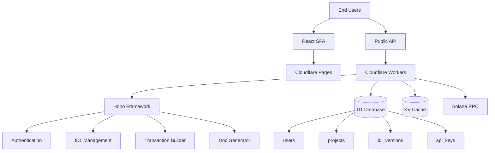
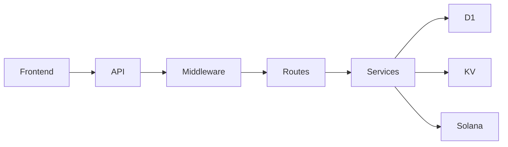
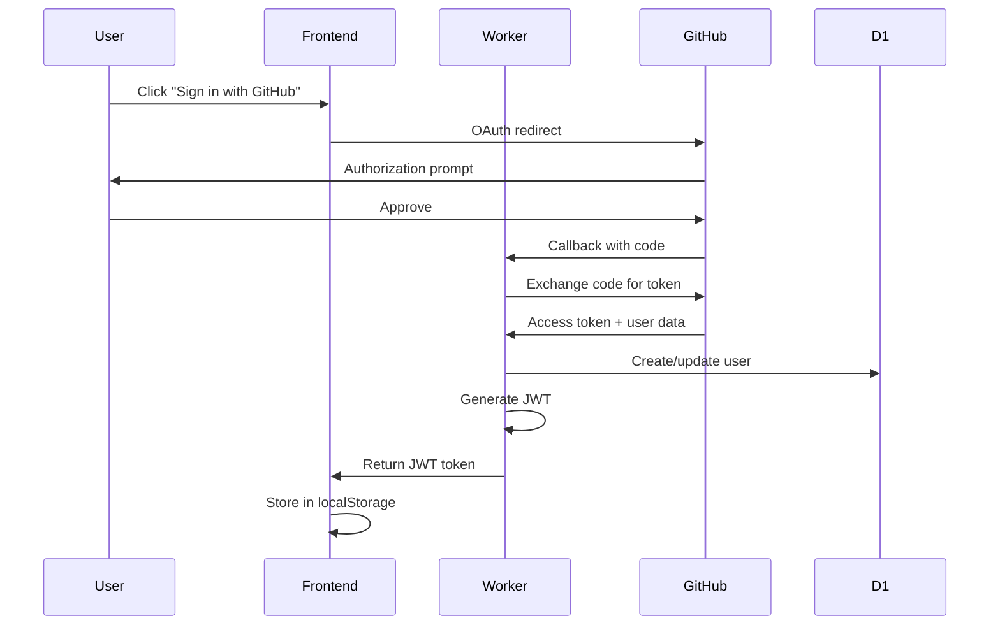
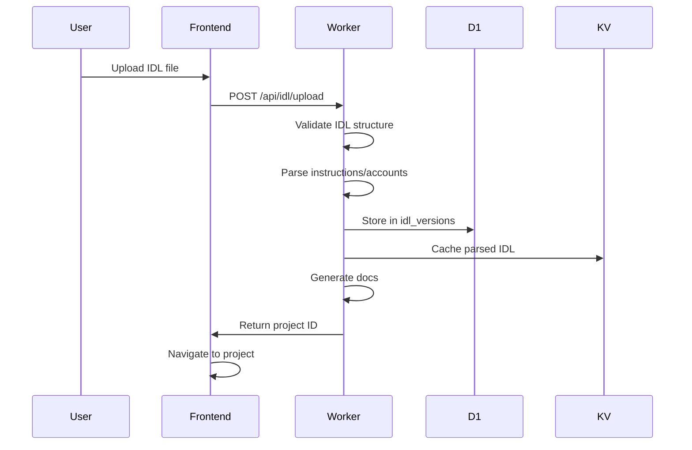
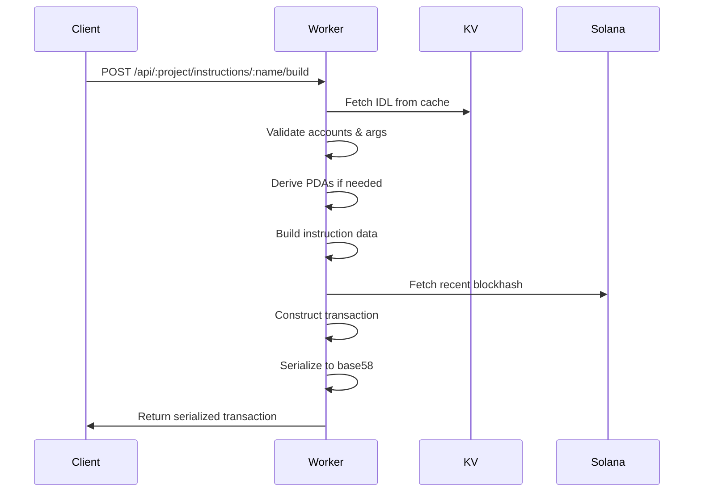

## Overview

Orquestra is built on a modern, serverless architecture leveraging **Cloudflare's global edge network**. The system transforms Solana Anchor IDLs into production-ready REST APIs with automatic transaction building, documentation generation, and AI-optimized endpoints.

## High-Level Architecture



## Architecture Diagram

```
┌─────────────────────────────────────────────────────────────┐
│                     End Users                               │
└─────────────────┬───────────────────────────────────────────┘
                  │
        ┌─────────┴──────────┐
        │                    │
   ┌────▼─────────┐   ┌──────▼──────────┐
   │   Frontend   │   │   API Explorer  │
   │ (React SPA)  │   │   & Dashboard   │
   └──────┬────┬──┘   └────────┬────────┘
          │    │               │
          │    └────┬──────────┘
          │         │
    ┌─────▼─────────▼────────────────────┐
    │  Cloudflare Pages & Workers        │
    │  ───────────────────────────────── │
    │  ┌──────────────────────────────┐  │
    │  │  Frontend Distribution       │  │
    │  │  (Static assets + SSR)       │  │
    │  └──────────────────────────────┘  │
    │  ┌──────────────────────────────┐  │
    │  │  Hono API Backend            │  │
    │  │  - Auth (GitHub OAuth)       │  │
    │  │  - IDL Management            │  │
    │  │  - Transaction Building      │  │
    │  │  - Documentation Generation  │  │
    │  └──────────────────────────────┘  │
    └──────┬──────────┬──────────────────┘
           │          │
    ┌──────▼──────────▼──────────────┐
    │   Cloudflare Infrastructure    │
    │   ──────────────────────────── │
    │  D1 │ KV │ Cache │ HTTP2 Push  │
    └──────┬──────────┬──────────────┘
           │          │
    ┌──────▼──────────▼───────────────┐
    │  Solana Blockchain              │
    │  - RPC Endpoints                │
    │  - Network Interactions         │
    └─────────────────────────────────┘
```

## Component Interactions

### Request Flow

1. **User Request** → Frontend or API call
2. **Edge Routing** → Cloudflare distributes to nearest data center
3. **Worker Execution** → Hono processes request at edge
4. **Middleware Chain** → Auth → Rate Limit → Cache → Validation
5. **Service Layer** → Business logic (IDL parser, tx builder, etc.)
6. **Data Layer** → D1 queries + KV cache lookups
7. **Response** → JSON returned to client

### Component Dependencies



## Data Flow

### Authentication Flow



**Steps:**

1. User clicks "Sign in with GitHub"
2. Redirects to GitHub OAuth authorization page
3. GitHub redirects to `/auth/github/callback` with code
4. Worker exchanges code for access token
5. Worker fetches user data from GitHub API
6. Creates/updates user in D1 database
7. Returns JWT token (7-day expiry)
8. Frontend stores token in localStorage
9. Frontend includes token in `Authorization` header

### IDL Upload Flow



**Steps:**

1. User uploads IDL JSON file via dashboard
2. Frontend validates file format and size (under 1MB)
3. Sends to `/api/idl/upload` endpoint with JWT
4. Worker validates IDL structure (name, version, instructions)
5. Stores in D1 `idl_versions` table
6. Caches in KV for fast retrieval (`idl:{projectId}:{version}`)
7. Generates Markdown documentation
8. Returns project ID and API endpoints

### Transaction Building Flow



**Steps:**

1. Client provides instruction name, accounts, and arguments
2. Sends POST request to `/api/{projectId}/instructions/{name}/build`
3. Worker:
   - Validates request data against IDL schema
   - Merges default values
   - Derives PDAs (Program Derived Addresses) if configured
   - Constructs Solana instruction with BorshSchema
   - Builds transaction with accounts
   - Fetches recent blockhash from Solana RPC
   - Serializes to base58 format
4. Returns serialized transaction + metadata

## Edge Deployment

### Cloudflare Workers

**Runtime Characteristics:**

- **V8 Isolates** - Lightweight, fast cold starts (under 1ms)
- **No Node.js** - Uses Web APIs (Fetch, Crypto, Streams)
- **Global Distribution** - 275+ data centers worldwide
- **Auto-scaling** - Handles millions of requests
- **Zero Config** - No servers to manage

**Performance:**

```
Cold Start:     < 1ms
Warm Latency:   < 50ms (p50)
Max Execution:  30 seconds (CPU time)
Memory Limit:   128MB per request
```

### Cloudflare D1

**SQLite at the Edge:**

- **Global Read Replicas** - Data replicated to all regions
- **Strong Consistency** - Writes to primary, reads from replicas
- **Automatic Backups** - Point-in-time recovery
- **Low Latency** - Under 10ms for most queries

**Limits:**

```
Row Size:       1MB max
Database Size:  500MB (free), 10GB+ (paid)
Queries/day:    5M (free), unlimited (paid)
```

### Cloudflare KV

**Key-Value Store:**

- **Eventually Consistent** - Optimized for reads
- **Global Distribution** - Low-latency worldwide
- **High Throughput** - Millions of reads/sec
- **TTL Support** - Automatic expiration

**Use Cases:**

- IDL caching (`idl:{projectId}:{version}`)
- Response caching (`resp:api:{path}`)
- Rate limiting counters (`rl:api:{ip}`)
- Session storage (optional)

## Scalability

### Horizontal Scaling

**Automatic:**

- Workers scale to handle demand
- D1 replicates reads globally
- KV distributes across edge

**Rate Limits:**

```typescript
General API:    100 req/min per IP
Auth Endpoints: 20 req/min per IP
IDL Upload:     10 req/min per user
Tx Building:    30 req/min per API key
```

### Database Optimization

**Caching Strategy:**

```
IDL Cache:      7 days (KV)
API Responses:  5 minutes (KV)
Documentation:  1 hour (KV)
Project List:   2 minutes (KV)
```

**Query Optimization:**

- Indexed columns: `user_id`, `project_id`, `program_id`
- Prepared statements for SQL injection prevention
- Connection pooling (automatic)

## Infrastructure as Code

Configuration in `wrangler.toml`:

```toml
name = "orquestra"
main = "packages/worker/src/index.ts"
compatibility_date = "2024-01-01"

[[d1_databases]]
binding = "DB"
database_name = "orquestra-prod"

[[kv_namespaces]]
binding = "IDLS"

[[kv_namespaces]]
binding = "CACHE"

[env.production.vars]
ENVIRONMENT = "production"
FRONTEND_URL = "https://orquestra.dev"
API_BASE_URL = "https://api.orquestra.dev"
```

## Monitoring & Observability

**Cloudflare Analytics:**

- Request count and error rates
- P50, P95, P99 latency metrics
- Bandwidth usage
- CPU time per request

**Custom Logging:**

- Request/response logging middleware
- Error tracking with stack traces
- Performance monitoring
- Rate limit violations

## Related Documentation

<CardGroup cols={2}>
  <Card title="Frontend Architecture" icon="react" href="/development/frontend">
    React 18, Zustand state management, and component structure
  </Card>
  <Card title="Backend Architecture" icon="server" href="/development/backend">
    Hono framework, services, and middleware patterns
  </Card>
  <Card title="Security Model" icon="shield" href="/development/security">
    Authentication, authorization, and security best practices
  </Card>
  <Card title="API Reference" icon="book" href="/api-reference/introduction">
    Complete API endpoint documentation
  </Card>
</CardGroup>