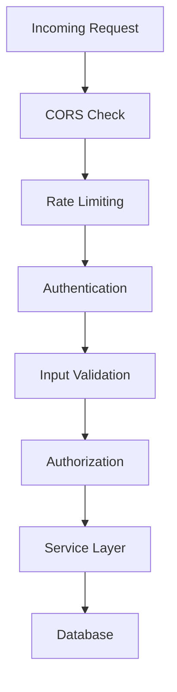
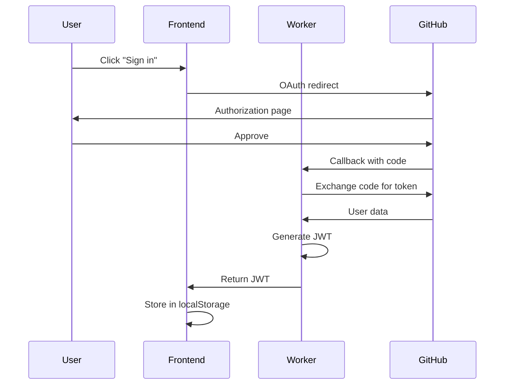

## Security Architecture

Orquestra implements a **defense-in-depth** security model with multiple layers of protection:



## Authentication Layers

### 1. GitHub OAuth 2.0

Used for **user authentication** in the dashboard:



**Implementation:**

```typescript routes/auth.ts
import { Hono } from 'hono'
import { generateJWT } from '../services/jwt'

const auth = new Hono()

// Initiate OAuth flow
auth.get('/github', (c) => {
  const clientId = c.env.GITHUB_OAUTH_ID
  const redirectUri = `${c.env.API_BASE_URL}/auth/github/callback`
  const scope = 'read:user user:email'
  
  const authUrl = `https://github.com/login/oauth/authorize?` +
    `client_id=${clientId}&` +
    `redirect_uri=${encodeURIComponent(redirectUri)}&` +
    `scope=${encodeURIComponent(scope)}`
  
  return c.redirect(authUrl)
})

// Handle OAuth callback
auth.get('/callback', async (c) => {
  const code = c.req.query('code')
  if (!code) {
    return c.json({ error: 'Missing authorization code' }, 400)
  }

  try {
    // Exchange code for access token
    const tokenResponse = await fetch('https://github.com/login/oauth/access_token', {
      method: 'POST',
      headers: {
        'Content-Type': 'application/json',
        'Accept': 'application/json',
      },
      body: JSON.stringify({
        client_id: c.env.GITHUB_OAUTH_ID,
        client_secret: c.env.GITHUB_OAUTH_SECRET,
        code,
      }),
    })

    const tokenData = await tokenResponse.json()
    const accessToken = tokenData.access_token

    // Fetch user data
    const userResponse = await fetch('https://api.github.com/user', {
      headers: {
        'Authorization': `Bearer ${accessToken}`,
        'Accept': 'application/vnd.github.v3+json',
      },
    })

    const userData = await userResponse.json()

    // Create or update user in database
    const db = c.env.DB
    await db
      .prepare(
        `INSERT INTO users (id, username, email, avatar_url, github_id) 
         VALUES (?, ?, ?, ?, ?) 
         ON CONFLICT(github_id) DO UPDATE SET 
           username = excluded.username,
           email = excluded.email,
           avatar_url = excluded.avatar_url,
           updated_at = datetime('now')`
      )
      .bind(
        crypto.randomUUID(),
        userData.login,
        userData.email,
        userData.avatar_url,
        userData.id
      )
      .run()

    // Generate JWT token
    const jwt = await generateJWT(
      {
        sub: userData.id.toString(),
        username: userData.login,
      },
      c.env.JWT_SECRET,
      7 * 24 * 60 * 60  // 7 days
    )

    // Redirect to frontend with token
    const frontendUrl = c.env.FRONTEND_URL
    return c.redirect(`${frontendUrl}/auth/callback?token=${jwt}`)
  } catch (error) {
    console.error('OAuth error:', error)
    return c.redirect(`${c.env.FRONTEND_URL}/auth/error`)
  }
})

export default auth
```

### 2. JWT Token Authentication

Used for **user sessions**:

**Token Format:**

```
Header.Payload.Signature (HS256)
```

**Payload:**

```json
{
  "sub": "12345",           // User ID
  "username": "alice",      // GitHub username
  "iat": 1703001600,         // Issued at
  "exp": 1703606400          // Expires in 7 days
}
```

**Middleware Implementation:**

```typescript middleware/auth.ts
import { Context, Next } from 'hono'
import { verifyJWT } from '../services/jwt'

export async function authMiddleware(c: Context, next: Next) {
  const authHeader = c.req.header('Authorization')

  if (!authHeader || !authHeader.startsWith('Bearer ')) {
    return c.json(
      { 
        error: 'Unauthorized', 
        message: 'Missing or invalid Authorization header' 
      },
      401
    )
  }

  const token = authHeader.slice(7)

  try {
    const payload = await verifyJWT(token, c.env.JWT_SECRET)
    
    // Set user context for downstream handlers
    c.set('userId', payload.sub)
    c.set('username', payload.username)
    c.set('jwtPayload', payload)

    await next()
  } catch (err) {
    return c.json(
      { 
        error: 'Unauthorized', 
        message: 'Invalid or expired token' 
      },
      401
    )
  }
}
```

**Usage:**

```typescript
import { authMiddleware } from './middleware/auth'

// Protect routes
app.get('/api/idl/upload', authMiddleware, async (c) => {
  const userId = c.get('userId')  // Available after auth
  // ... handle upload
})
```

### 3. API Key Authentication

Used for **programmatic access**:

**Key Format:**

```
ork_1a2b3c4d5e6f7g8h9i0j  (prefix: ork_)
```

**Storage:**

```sql
CREATE TABLE api_keys (
  id TEXT PRIMARY KEY,
  project_id TEXT NOT NULL,
  key TEXT UNIQUE NOT NULL,
  label TEXT,
  expires_at DATETIME,
  last_used DATETIME,
  created_at DATETIME DEFAULT CURRENT_TIMESTAMP,
  FOREIGN KEY (project_id) REFERENCES projects(id)
);
```

**Middleware:**

```typescript middleware/auth.ts
export async function apiKeyMiddleware(c: Context, next: Next) {
  const apiKey = c.req.header('X-API-Key')

  if (!apiKey) {
    return c.json(
      { error: 'Unauthorized', message: 'Missing X-API-Key header' },
      401
    )
  }

  const db = c.env.DB
  const result = await db
    .prepare(
      `SELECT ak.*, p.user_id, p.name as project_name 
       FROM api_keys ak 
       JOIN projects p ON ak.project_id = p.id 
       WHERE ak.key = ? 
       AND (ak.expires_at IS NULL OR ak.expires_at > datetime('now'))`
    )
    .bind(apiKey)
    .first()

  if (!result) {
    return c.json(
      { error: 'Unauthorized', message: 'Invalid or expired API key' },
      401
    )
  }

  // Update last_used (non-blocking)
  c.executionCtx.waitUntil(
    db.prepare('UPDATE api_keys SET last_used = datetime(\'now\') WHERE key = ?')
      .bind(apiKey)
      .run()
  )

  c.set('apiKeyProjectId', result.project_id)
  c.set('apiKeyUserId', result.user_id)

  await next()
}
```

## CORS Configuration

**Cross-Origin Resource Sharing** is configured to allow only trusted origins:

```typescript index.ts
import { cors } from 'hono/cors'

app.use(
  '*',
  cors({
    origin: (origin: string) => {
      const allowedOrigins = [
        'https://orquestra.dev',
        'http://localhost:3000',
        'http://localhost:5173',
      ]
      return allowedOrigins.includes(origin) ? origin : allowedOrigins[0]
    },
    allowHeaders: ['Content-Type', 'Authorization', 'X-API-Key'],
    allowMethods: ['GET', 'POST', 'PUT', 'DELETE', 'OPTIONS'],
    credentials: true,
    maxAge: 86400,  // 24 hours
  })
)
```

**Headers Set:**

```
Access-Control-Allow-Origin: https://orquestra.dev
Access-Control-Allow-Methods: GET, POST, PUT, DELETE, OPTIONS
Access-Control-Allow-Headers: Content-Type, Authorization, X-API-Key
Access-Control-Allow-Credentials: true
Access-Control-Max-Age: 86400
```

## Input Validation

### Validation Service

Lightweight validation without heavy dependencies:

```typescript services/validation.ts
export interface ValidationError {
  field: string
  message: string
}

export interface ValidationResult<T> {
  success: boolean
  data?: T
  errors?: ValidationError[]
}

const BASE58_REGEX = /^[1-9A-HJ-NP-Za-km-z]{32,44}$/

/**
 * Validate transaction build request
 */
export function validateBuildRequest(body: unknown): ValidationResult<any> {
  const errors: ValidationError[] = []

  if (typeof body !== 'object' || !body) {
    return { 
      success: false, 
      errors: [{ field: 'body', message: 'Request body must be JSON object' }] 
    }
  }

  const data = body as any

  // Validate payer
  if (!data.payer || typeof data.payer !== 'string') {
    errors.push({ field: 'payer', message: 'Payer public key is required' })
  } else if (!BASE58_REGEX.test(data.payer)) {
    errors.push({ field: 'payer', message: 'Invalid base58 public key' })
  }

  // Validate accounts
  if (!data.accounts || typeof data.accounts !== 'object') {
    errors.push({ field: 'accounts', message: 'Accounts object is required' })
  } else {
    for (const [key, value] of Object.entries(data.accounts)) {
      if (typeof value !== 'string' || !BASE58_REGEX.test(value as string)) {
        errors.push({ 
          field: `accounts.${key}`, 
          message: `Invalid public key for "${key}"` 
        })
      }
    }
  }

  // Validate args (must be object if present)
  if (data.args !== undefined && typeof data.args !== 'object') {
    errors.push({ field: 'args', message: 'Args must be an object' })
  }

  if (errors.length > 0) {
    return { success: false, errors }
  }

  return {
    success: true,
    data: {
      payer: data.payer,
      accounts: data.accounts,
      args: data.args || {},
    },
  }
}
```

### SQL Injection Prevention

**Always use prepared statements:**

```typescript
// ✅ SAFE - Parameterized query
const result = await db
  .prepare('SELECT * FROM projects WHERE id = ?')
  .bind(projectId)
  .first()

// ❌ UNSAFE - String concatenation
const result = await db
  .prepare(`SELECT * FROM projects WHERE id = '${projectId}'`)
  .first()
```

### XSS Prevention

- **Content-Type** headers set correctly
- **No user input** rendered directly in HTML
- React automatically escapes JSX content
- API returns JSON only (not HTML)

## Rate Limiting

Distributed rate limiting using **Cloudflare KV**:

### Implementation

```typescript middleware/rate-limit.ts
export function rateLimiter(opts: RateLimitOptions) {
  const { limit, windowSec, prefix = 'rl' } = opts

  return async (c: Context, next: Next) => {
    const cache = c.env.CACHE
    const ip = c.req.header('CF-Connecting-IP') || 'unknown'
    const key = `${prefix}:${ip}`

    const raw = await cache.get(key)
    const now = Date.now()

    let entry: RateLimitEntry
    if (raw) {
      entry = JSON.parse(raw)
      if (now > entry.resetAt) {
        entry = { count: 1, resetAt: now + windowSec * 1000 }
      } else {
        entry.count++
      }
    } else {
      entry = { count: 1, resetAt: now + windowSec * 1000 }
    }

    // Set headers
    c.header('X-RateLimit-Limit', String(limit))
    c.header('X-RateLimit-Remaining', String(Math.max(0, limit - entry.count)))
    c.header('X-RateLimit-Reset', String(Math.ceil(entry.resetAt / 1000)))

    if (entry.count > limit) {
      const retryAfter = Math.ceil((entry.resetAt - now) / 1000)
      c.header('Retry-After', String(retryAfter))
      return c.json(
        {
          error: 'Too Many Requests',
          message: `Rate limit exceeded. Try again in ${retryAfter}s.`,
          retryAfter,
        },
        429
      )
    }

    await cache.put(key, JSON.stringify(entry), { expirationTtl: windowSec + 10 })
    await next()
  }
}
```

### Rate Limit Presets

```typescript
// General API endpoints
export const apiRateLimit = rateLimiter({
  limit: 100,        // 100 requests
  windowSec: 60,     // per minute
  prefix: 'rl:api',
})

// Authentication endpoints
export const authRateLimit = rateLimiter({
  limit: 20,
  windowSec: 60,
  prefix: 'rl:auth',
})

// IDL upload (more restrictive)
export const uploadRateLimit = rateLimiter({
  limit: 10,
  windowSec: 60,
  prefix: 'rl:upload',
})

// Transaction building
export const buildRateLimit = rateLimiter({
  limit: 30,
  windowSec: 60,
  prefix: 'rl:build',
})
```

## Secret Management

### Cloudflare Workers Secrets

Sensitive values stored as **encrypted secrets**:

```bash
# Set secrets (encrypted at rest)
wrangler secret put GITHUB_OAUTH_SECRET
wrangler secret put JWT_SECRET
wrangler secret put SOLANA_RPC_URL
```

**Access in code:**

```typescript
const jwtSecret = c.env.JWT_SECRET  // Available at runtime
```

### Environment Variables

Non-sensitive config in `wrangler.toml`:

```toml
[env.production.vars]
ENVIRONMENT = "production"
FRONTEND_URL = "https://orquestra.dev"
API_BASE_URL = "https://api.orquestra.dev"
CORS_ORIGIN = "https://orquestra.dev"
```

### Secret Rotation

**Best Practices:**

1. Rotate JWT secrets every 90 days
2. Rotate OAuth secrets on breach
3. Use different secrets per environment
4. Never commit secrets to git
5. Use `wrangler secret` for production

## Authorization

### Resource Ownership

**Check user owns resource before modification:**

```typescript
app.delete('/api/idl/:projectId', authMiddleware, async (c) => {
  const userId = c.get('userId')
  const projectId = c.req.param('projectId')

  // Verify ownership
  const project = await db
    .prepare('SELECT * FROM projects WHERE id = ? AND user_id = ?')
    .bind(projectId, userId)
    .first()

  if (!project) {
    return c.json({ error: 'Project not found or access denied' }, 404)
  }

  // Delete project
  await db.prepare('DELETE FROM projects WHERE id = ?').bind(projectId).run()
  
  return c.json({ success: true })
})
```

### Public vs Private Projects

```typescript
// Public projects - no auth required
app.get('/api/:projectId/instructions', async (c) => {
  const projectId = c.req.param('projectId')
  
  const project = await db
    .prepare('SELECT * FROM projects WHERE id = ? AND is_public = 1')
    .bind(projectId)
    .first()

  if (!project) {
    return c.json({ error: 'Project not found or private' }, 404)
  }

  // Return public data
})

// Private projects - require API key
app.get(
  '/api/:projectId/instructions',
  apiKeyMiddleware,
  async (c) => {
    // Access granted via API key
  }
)
```

## Security Headers

```typescript middleware/security-headers.ts
export function securityHeaders(c: Context, next: Next) {
  c.header('X-Content-Type-Options', 'nosniff')
  c.header('X-Frame-Options', 'DENY')
  c.header('X-XSS-Protection', '1; mode=block')
  c.header('Referrer-Policy', 'strict-origin-when-cross-origin')
  c.header(
    'Content-Security-Policy',
    "default-src 'self'; script-src 'self' 'unsafe-inline'; style-src 'self' 'unsafe-inline'"
  )
  await next()
}
```

## Monitoring & Auditing

### Request Logging

```typescript middleware/request-logger.ts
export async function requestLogger(c: Context, next: Next) {
  const start = Date.now()
  const method = c.req.method
  const path = c.req.path
  const ip = c.req.header('CF-Connecting-IP')

  await next()

  const duration = Date.now() - start
  const status = c.res.status

  console.log(JSON.stringify({
    timestamp: new Date().toISOString(),
    method,
    path,
    status,
    duration,
    ip,
    userAgent: c.req.header('User-Agent'),
  }))
}
```

### Error Tracking

```typescript
try {
  // Sensitive operation
} catch (error) {
  console.error('Error:', {
    message: error.message,
    stack: error.stack,
    context: { userId, projectId },
  })
  
  return c.json({ error: 'Internal server error' }, 500)
}
```

## Security Best Practices

<AccordionGroup>
  <Accordion title="Authentication">
    - Use HTTPS only (enforced by Cloudflare)
    - Rotate JWT secrets regularly
    - Set token expiration (7 days max)
    - Invalidate tokens on logout
    - Use secure session storage
  </Accordion>

  <Accordion title="Authorization">
    - Check resource ownership
    - Implement least privilege
    - Validate all user inputs
    - Use prepared SQL statements
    - Separate public/private data
  </Accordion>

  <Accordion title="Rate Limiting">
    - Implement per-IP limits
    - Limit per API key
    - Use exponential backoff
    - Return Retry-After header
    - Monitor abuse patterns
  </Accordion>

  <Accordion title="Data Protection">
    - Never log secrets
    - Encrypt sensitive data at rest (D1)
    - Use TLS for all connections
    - Sanitize error messages
    - Implement CORS properly
  </Accordion>
</AccordionGroup>

## Security Checklist

- [ ] All secrets stored as Cloudflare secrets
- [ ] JWT tokens expire within 7 days
- [ ] Rate limiting enabled on all public endpoints
- [ ] CORS configured with allowlist
- [ ] All SQL queries use prepared statements
- [ ] User input validated before processing
- [ ] Resource ownership checked before mutations
- [ ] Security headers set on all responses
- [ ] Request logging enabled
- [ ] Error messages sanitized (no stack traces)

## Reporting Security Issues

<Warning>
  **Do not create public GitHub issues for security vulnerabilities.**
</Warning>

Report security issues via:

- GitHub Security Advisories
- Email: security@orquestra.dev
- Private disclosure preferred

## Related Documentation

<CardGroup cols={2}>
  <Card title="Backend Architecture" icon="server" href="/development/backend">
    Middleware and service layer implementation
  </Card>
  <Card title="System Architecture" icon="sitemap" href="/development/architecture">
    Overall system design and data flow
  </Card>
  <Card title="API Reference" icon="book" href="/api-reference/introduction">
    API endpoints and authentication methods
  </Card>
  <Card title="Deployment" icon="rocket" href="/guides/deployment">
    Production deployment and configuration
  </Card>
</CardGroup>